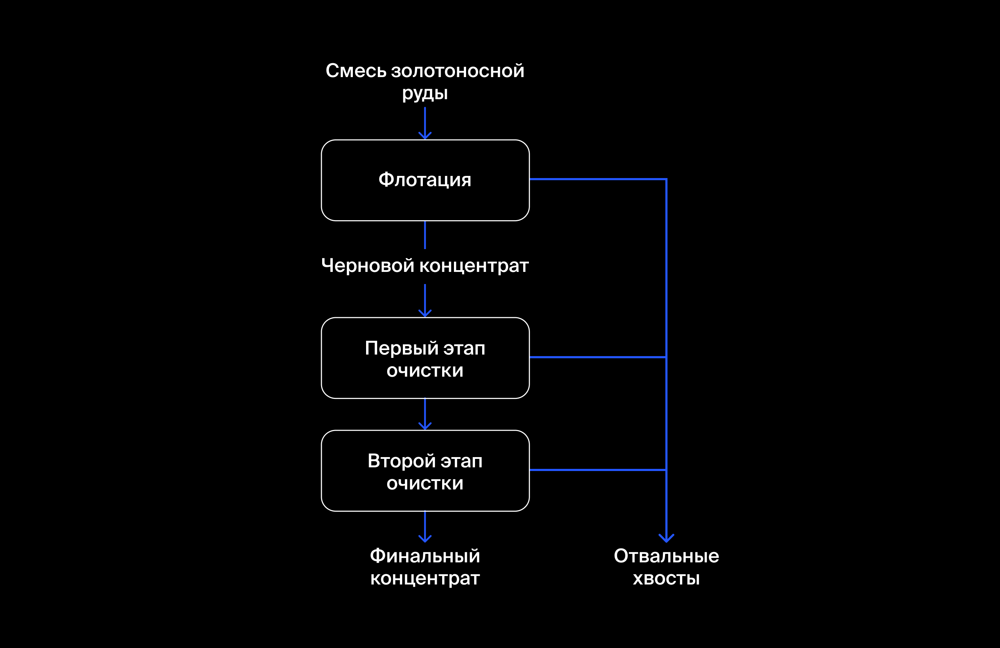

# Исследование технологического процесса очистки золота

## Задача проекта
Спрогнозировать концентрацию золота при проведении процесса очистки золота.

## Аннотация проекта
Обучено несколько моделей для прогнозирования коэффициента восстановления золота из золотосодержащей руды на основе данных с параметрами добычи и очистки. Исследовано изменение концентрации элементов на каждом этапе очистки руды. Проанализированы гистограммы распределения размеров гранул сырья в обучающей и тестовой выборках. Исследованы суммарные концентрации элементов (Au, Ag, Pb) на разных стадиях техпроцесса: в сырье, в черновом и финальном концентратах.

## Ключевые слова проекта
анализ данных, регрессия, подбор гиперпараметров под пользовательскую метрику sMAPE

## Описание технологического процесса очистки золота

Стадии техпроцесса очистки:
1. Флотация
Во флотационную установку подаётся смесь золотосодержащей руды. После обогащения получается черновой концентрат и «отвальные хвосты», то есть остатки продукта с низкой концентрацией ценных металлов.
На стабильность этого процесса влияет непостоянное и неоптимальное физико-химическое состояние флотационной пульпы (смеси твёрдых частиц и жидкости).
2. Очистка
Черновой концентрат проходит две очистки. На выходе получается финальный концентрат и новые отвальные хвосты.

## Описание исходных данных

Технологический процесс
-	Rougher feed — исходное сырье
-	Rougher additions (или reagent additions) — флотационные реагенты: Xanthate, Sulphate, Depressant
    -	Xanthate **— ксантогенат (промотер, или активатор флотации);
    -	Sulphate — сульфат (на данном производстве сульфид натрия);
    -	Depressant — депрессант (силикат натрия).
-	Rougher process (англ. «грубый процесс») — флотация
-	Rougher tails — отвальные хвосты
-	Float banks — флотационная установка
-	Cleaner process — очистка
-	Rougher Au — черновой концентрат золота
-	Final Au — финальный концентрат золота

Параметры этапов
-	air amount — объём воздуха
-	fluid levels — уровень жидкости
-	feed size — размер гранул сырья
-	feed rate — скорость подачи

Наименование признаков
Наименование признаков должно быть такое:
[этап].[тип_параметра].[название_параметра]
Пример: rougher.input.feed_ag

Возможные значения для блока [этап]:
-	rougher — флотация
-	primary_cleaner — первичная очистка
-	secondary_cleaner — вторичная очистка
-	final — финальные характеристики

Возможные значения для блока [тип_параметра]:
-	input — параметры сырья
-	output — параметры продукта
-	state — параметры, характеризующие текущее состояние этапа
-	calculation — расчётные характеристики

Целевые признаки
- rougher.output.recovery — эффективность обогащения чернового концентрата ;
- final.output.recovery — эффективность обогащения финального концентрата.

## Статус проекта
Завершён.